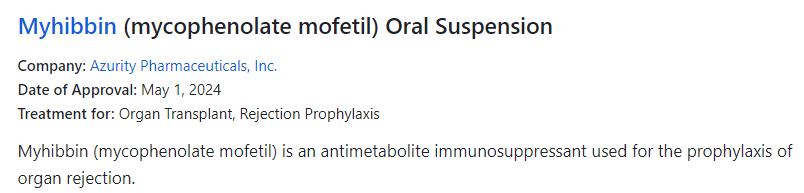

# 🔄 New Drug Approvals Scraper

This Python package automates the scraping, cleaning, and classification of new drug approval data from [Drugs.com](https://www.drugs.com/newdrugs.html). Designed for robustness and versatility, it integrates data processing techniques with AI-driven classification using OpenAI's GPT-4o-mini, enabling enriched data analysis within dynamic environments like Dash applications.

## 🧹 Data Cleaning and Normalization

### 🧽 Cleaning Techniques

The scraper meticulously extracts and refines data, addressing variations in drug names, generics, and administration methods. Using regular expressions, the `extract_generic_and_admin` function isolates and sanitizes these components, ensuring data uniformity and precision. An example can be seen in the formatting of drug names as shown below:

**Key Cleaning Operations:**
- **Drug Names**: Separating combined names and administration routes using custom regular expressions.
- **Generics**: Clearing empty parentheses or irrelevant details enclosed within double parentheses.
- **Administration Methods**: Filtering out non-essential text such as outdated drug names or initial prepositions.

### 🔧 Normalization

Normalization processes target company names that often appear with slight variations in formatting, punctuation, or presentation. Using the `clean_company_name` function, we standardize these names to reduce the complexity and ensure consistency across the dataset. Here’s how specific issues are addressed:

- **Removing Redundant Suffixes**: Strips common corporate suffixes like "Inc.", "Ltd.", "Corp.", "Corporation", and others to maintain a clean, uniform database.
- **Unifying Abbreviations and Full Names**: Converts abbreviations to their full forms and ensures that variations in company names are standardized to a single, consistent format.
- **Standardizing Collaboration Descriptions**: Variations in the representation of collaboration between companies, such as "and", "&", "+", "/", are unified to "and" to maintain consistency in joint ventures or co-developed products.

**Example Transformations:**

| Original Company Name                                   | Normalized Company Name |
|---------------------------------------------------------|-------------------------|
| Pfizer, Inc.                                            | Pfizer                  |
| Pfizer Inc.                                             | Pfizer                  |
| AMAG Pharmaceuticals, Inc.                              | AMAG Pharmaceuticals    |
| AFT Pharmaceuticals Ltd.                                | AFT Pharmaceuticals     |
| ALK-Abelló A/S                                          | ALK-Abelló              |
| GSK                                                     | GlaxoSmithKline         |
| GlaxoSmithKline PLC                                     | GlaxoSmithKline         |
| Amgen, Inc.                                             | Amgen                   |
| Daiichi Sankyo Company, Limited                         | Daiichi Sankyo          |
| AstraZeneca and Daiichi Sankyo Company, Limited         | AstraZeneca and Daiichi Sankyo |
| Bristol-Myers Squibb Company / Gilead Sciences, Inc.    | Bristol-Myers Squibb Company and Gilead Sciences |
| Boehringer Ingelheim Pharmaceuticals, Inc. and Eli Lilly| Boehringer Ingelheim Pharmaceuticals and Eli Lilly |

These methods enhance the reliability of data for subsequent analyses by ensuring that each entity is represented uniformly, reducing the number of unique company names from approximately 1000 to 700.

## 🏷️ Data Classification with AI

Utilizing LangChain integrated with OpenAI's GPT-3.5 Turbo, the scraper enriches the extracted data by categorizing medications and their treatment categories. This process not only simplifies complex medical information but also facilitates insightful trend analysis across various disease treatments. The integration with LangChain allows dynamic interaction with data, applying logical rules to categorize drugs based on their detailed descriptions and intended uses.

## 📦 Package Structure and Versatility

The scraper is structured as a Python package, enabling it to function independently or as part of larger systems:

- `scraper.py`: Handles data collection logic.
- `classification.py`: Manages AI-driven data categorization.
- `utils.py`: Provides utility functions for data manipulation.
- `init.py`: Initializes the directory as a Python package for easy import.

## 🔄 Using the Scraper

To use the scraper, manage the OpenAI API key through one of the following methods:
1. **Environment Variable**: Store the API key in an environment variable which the scraper accesses.
2. **Direct Specification**: Directly pass the API key to the function when invoking it.

## 🌐 Example Integration

For a live example of how this scraper package is utilized within a Dash ecosystem to provide real-time updates on drug approvals, visit the [New Drug Approvals Dashboard repository](https://github.com/Tanguy9862/new-drug-approvals-dashboard).
